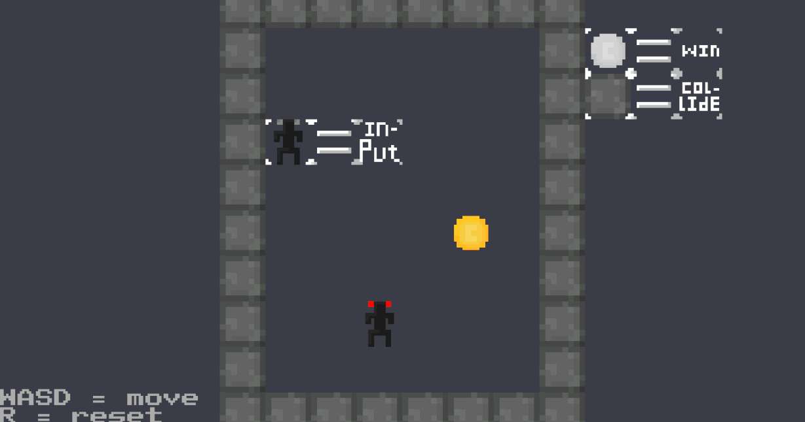

# Project

For this school project I needed to create a game using Unity. I decided upon trying to repeat some of the mechanics found in the game [Baba is You](https://store.steampowered.com/app/736260/Baba_Is_You/). As I found the challenge interesting and the game inspired me.

## What I learned

I learned that Unity isn't the tool for me. My main concern this project was making _my code_ work with how Unity works.
